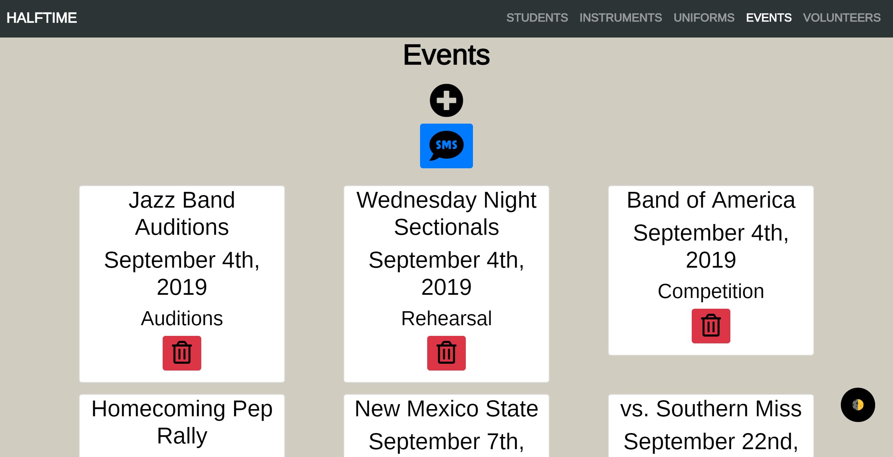

# HalfTime

This is my Full Stack Capstone Project for Nashville Software School. HalfTime is an application for band directors to manage and track the program’s students, instruments, uniforms and events. The application was made with React and various components to enhance the experience. Twilio's API allows the primary user to send SMS messages to volunteers about upcoming events. Other technologies include C# and .NET.

## Technologies Used
* [Animate CSS](https://daneden.github.io/animate.css/)
* ASP.Net
* Axios
* Bootstrap 4
* C#
* Dapper
* [Darkmode.js](https://darkmodejs.learn.uno/)
* HTML
* JavaScript
* React
* [React-DatePicker](https://www.npmjs.com/package/react-datepicker)
* [React Search Field](https://www.npmjs.com/package/react-search-field)
* Sass
* SQL
* Twilio
* Webpack

## Screen shots

1. Home Page

2. Home Page (Dark Mode)

3. Students Page

4. Students Page Add

5. Instruments Page

6. Individual Instrument Page

7. Individual Instrument Page (Dark Mode)

8. Uniforms Page

9. Events Page

10. Events SMS Alert

11. Volunteers Page

    

## Contributors:
* [Colin White](https://github.com/colinlwhite)
* [Nathan Gonzalez](https://github.com/copypastedeveloper) - Lead Instructor
* [Martin Cross](https://github.com/franticallycodes) - Teaching Assistant
* [Adam Wieckert](https://github.com/awieckert) - Teaching Assistant

